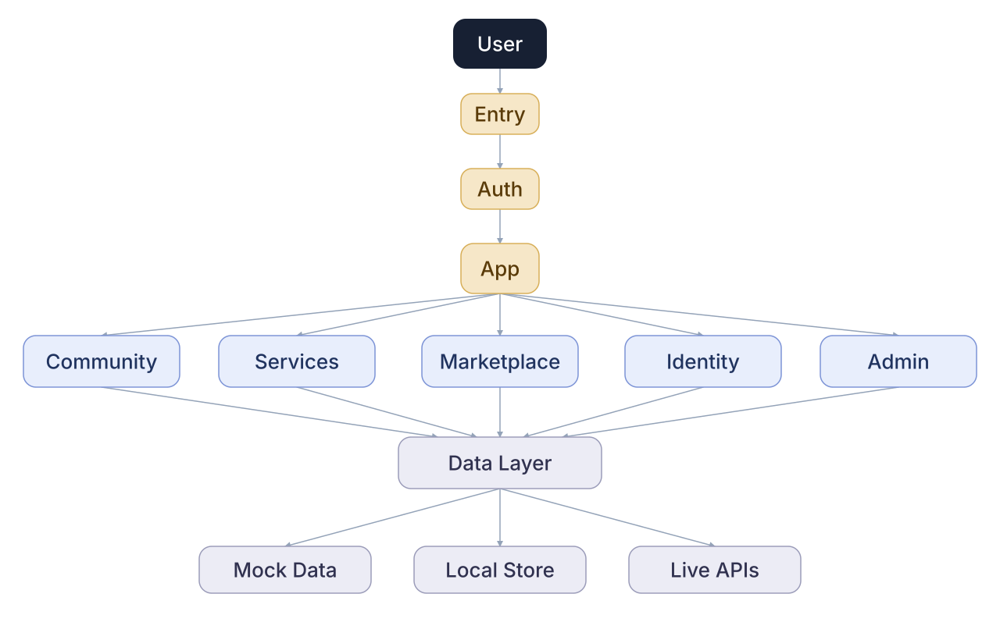
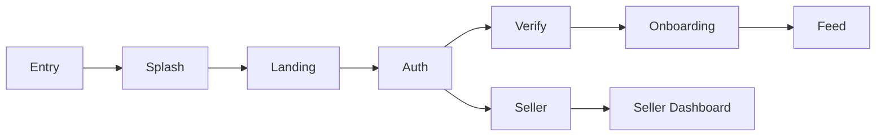
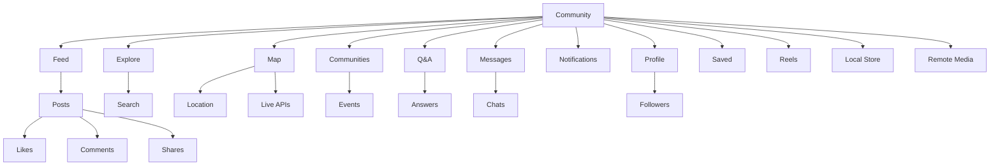
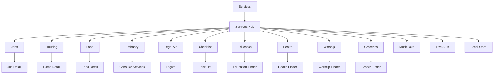
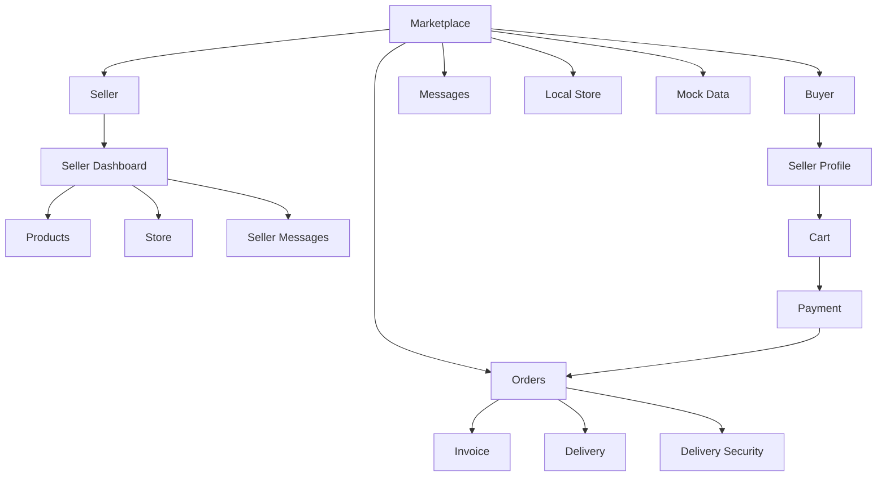
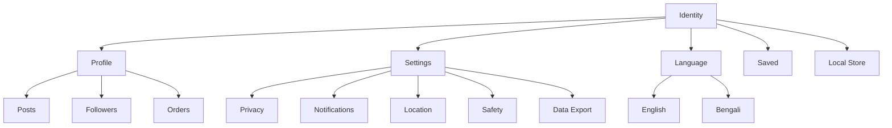
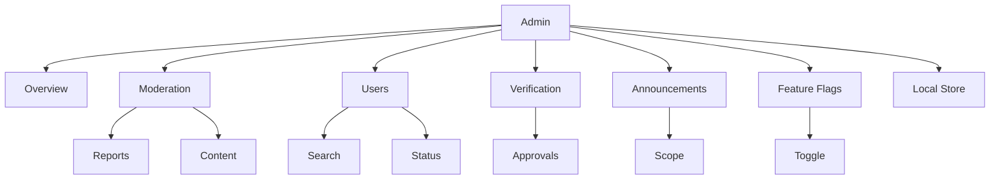
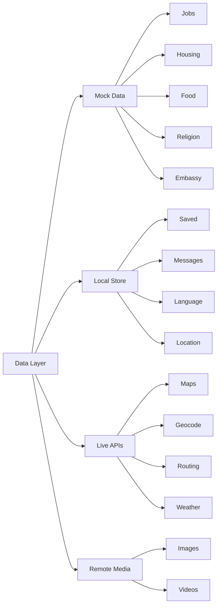
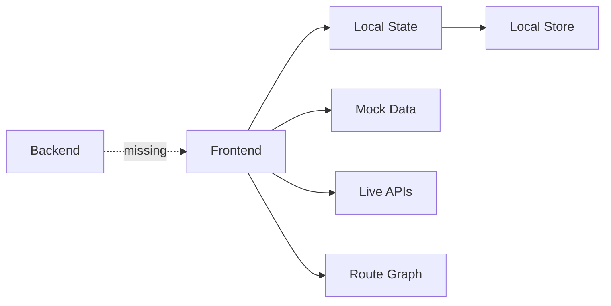

# ImmigrantConnect

Investor-ready system and data-flow diagrams for the current frontend prototype.

Labels are intentionally short so the product story is readable at a glance.

## Master prompt

```text
Create a clean investor-facing overview diagram for ImmigrantConnect, a newcomer support platform. Keep the full system shallow and readable: User → Entry → Auth → App → five main modules → Data Layer. Use only 1–2 words per node. Show only these main modules: Community, Services, Marketplace, Identity, and Admin. Show only these data sources: Mock Data, Local Store, and Live APIs. Use normal thin 1px arrows, generous spacing, a minimal white canvas, rounded rectangles, and one accent color per module. Do not use bold arrows, thick lines, wedge-shaped connectors, hidden layout links, deep submodules, long labels, paragraphs, metrics, decorative illustrations, or crossing connectors. After the overview, create separate deeper diagrams for each main module using the same short-label rule and visual language.
```

## Full system



## Entry



## Community



## Services



## Marketplace



## Identity



## Admin



## Data layer



## Current scope


